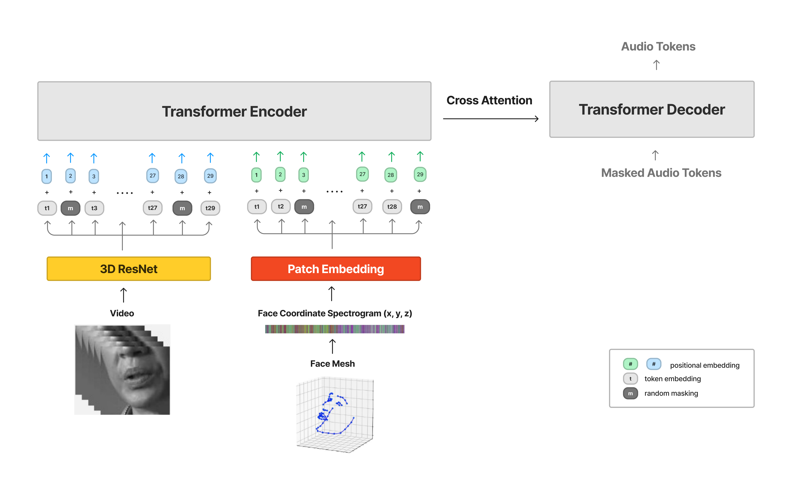

# Tokenized Lip Reading

Self-Supervised Pretraining for Cross Modal Video Language Transformers to achieve SOTA performance in Lip Reading in the Wild (LRW) Benchmark.

### Abstract

The goal is to construct model which classifies spoken words from video solely based on visual input. Lip reading classification models are consisted of frontend-backend structure, where dominant backend modules are intricate recurrent or temporal convolutional network. The team proposes new training strategy: (1) pretraining encoder-decoder transformer with input of facial landmark spectrograms and grayscale videos yielding captioning loss from the output of pseudo-labeled audio tokens, (2) finetuning pretrained encoder only for the classification task. **Two-stage training methodology requires no extra data and achieves state of the art performance by improving previous transformer baseline by +12.5%p in LRW benchmark.** Our model achieves 88.75% test accuracy after training 23 hours on three GPUs, reducing total training costs by 18% compared to RNN based baseline.

|     Method      |    Venue    |           Organization           | Spatial Module | Temporal Module | LRW Test Accuracy(%) |
| :-------------: | :---------: | :------------------------------: | :------------: | :-------------: | :------------------: |
|   Weng et al.   |  BMVC 2019  |             CMU, USA             |      I3D       |     BiLSTM      |         84.1         |
|   Luo et al.    |  BMVC 2020  |            CAS, China            |    Resnet18    |   Transformer   |         76.2         |
|   Zhao et al.   |  AAAI 2020  |            CAS, China            |    Resnet18    |   BiGRU+LSTM    |         84.4         |
|    Xu et al.    |  CVPR 2020  |           Xpeng motors           |    Resnet50    |     BiLSTM      |         84.8         |
| Martinez et al. | ICASSP 2020 | Imperial College U.K Facebook AI |    Resnet18    |     MS-TCN      |         85.3         |
|   Kim et al.    |  CVPR 2021  |           KAIST, Korea           |    Resnet18    |      BiGRU      |         85.4         |
|    Ma et al.    | ICASSP 2021 | Imperial College U.K Samsung AI  |    Resnet18    |     MS-TCN      |         87.9         |
|    Ma et al.    |  WACV 2021  | Imperial College U.K Facebook AI |    Resnet18    |     DC-TCN      |         88.4         |
|   Kim et al.    |  AAAI 2022  |           KAIST, Korea           |    Resnet18    |   MS-TCN/MVM    |         88.5         |
|    **Ours**     |      -      |   **Yonsei University, Korea**   |  **Resnet18**  | **Transformer** |      **88.75**       |

### Face Coordinate Spectrogram

For the face coordinate, the team quantized 3 channel(RGB) x 29 frame x 256 width x 256 height video into 3 channel(X,Y,Z) x 29 frame x 420 coordinate image. Each coordinate’s (X,Y,Z) coordinate is given as channel, where spatial characteristics lie in the width and temporal axis is the height.

|          Original Video          |                  Face Landmark Video                   |
| :------------------------------: | :----------------------------------------------------: |
|  |  |

| Face Coordinate Spectrogram  |
| :--------------------------: |
|  |

Previous research focused on utilizing such coordinate information to reorient and normalize the position of the face. However, interpolating entire facial features’ coordinate information to use as another input will resolve previous problem of disposing nonverbal communication cues outside of RoI.

In order to check whether such information contain cues for the model to classify speeches, representation of such face coordinates is given as input for the gMLP classification model with tiny attention. 18 layers of gMLP block of 384 dimension and single-head attention with 48 dimension yielded output of 58.484% of validation accuracy and 57.37% of test accuracy. CNN models underperformed patchified classification due to max pooling operations halving the frame-wise resolution. Therefore, patchifying face spectrograms as embedding does provide helpful information for visual speech recognition.

### Two Stage Training

Instead of fitting the bidirectional encoder to the classification task, BERT-alike 12 layers encoder model first learns spatial-lingual features by being assigned with difficult task of generation as illustrated below.

**Pretraining Encoder-Decoder Transformer**



- Embedded video with 3D Resnet and patchified face coordinate spectrogram image, similar to [SIMVLM](https://arxiv.org/pdf/2108.10904.pdf).
- Trained transformer model with captioning loss using masked input and masked output, similar to [T5](https://arxiv.org/abs/1910.10683).
- Set encoder deeper than decoder in order to enable better feature extraction, similar to [VideoMAE](https://arxiv.org/abs/2203.12602).
- Provided audio tokens, noisy pseudo-labels leveraging Wav2Vec2 model, in order to capture peripheral audio features around the target, similar to [AudioLM](https://arxiv.org/pdf/2209.03143.pdf).
  | Noisy Pseudo Labels | Encoder-Decoder Prediction |
  | :---------------------: | :------------------------: |
  | ABSONLUTELY DEAD | ABSOLUTELY TAKE |
  | R IS AN OBSECTY HEW | IS IT ABSOLUTELY COU |
  | T THERE IS ABSENTL IN A | ABSOLUTELY CO |
  | NO ABSET YE NOT | ARE ABSOLUTELY NICE |
  | RELATE I OPES'LL BE | ABSOLUTELY |

**Finetuning Bidirectional Encoder**


- Utilized previously pretrained 3D ResNet, patch embedding and transformer encoder weights for downstream task.
- Passed on last 4 encoder layers' hidden states to the classification head.
- Supplied both the original input and flipped input to the model per training step where the difference between the output logits act as regularization.
- Applied label smoothing loss and mixup augmentation.

### Pretrained Weights & Hyperparams

- [🔗 Encoder-Decoder Transformer Checkpoint](https://drive.google.com/file/d/1o-n8J0gHlLmIO37kFB-9tvHHTAPtuciv/view?usp=share_link)
- [🔗 Finetuned Bidirectional Encoder Checkpoint](https://drive.google.com/file/d/1f8aHeY79VqdSjnT9YZ9Tp2IKfUayqhUM/view?usp=share_link)

| Pretraining Hyperparams | Encoder-Decoder Transformer |
| :---------------------: | :-------------------------: |
|     Training Hours      |            11hrs            |
|         #Epochs         |              7              |
|         #Params         |             93M             |
|   Computing Resource    |        V100 32GB x 3        |
|       Batch Size        |           64 x 3            |
|         #Layers         |   12 Encoder + 6 Decoder    |
|  Initial Learning Rate  |            3e-4             |
|      Weight Decay       |            1e-2             |
|        Optimizer        |            AdamW            |
|      LR Scheduler       |      CosineAnnealingLR      |
|        Dimension        |             512             |
|    #Attention Heads     |              8              |
|    Embedding Dropout    |            0.15             |
|   FeedForward Dropout   |             0.3             |

| Finetuning Hyperparams |   Bidirectional Encoder   |
| :--------------------: | :-----------------------: |
|     Training Hours     |           12hrs           |
|        #Epochs         |            10             |
|        #Params         |            63M            |
|   Computing Resource   |       V100 32GB x 3       |
|       Batch Size       |          64 x 3           |
| Initial Learning Rate  |           1e-4            |
|      Weight Decay      |           1e-2            |
|        #Layers         | 12 Encoder + 1 Classifier |
|       Optimizer        |           AdamW           |
|      LR Scheduler      |     CosineAnnealingLR     |
|       Dimension        |            512            |
|    #Attention Heads    |             8             |
|   Embedding Dropout    |           0.15            |
|  FeedForward Dropout   |            0.3            |

### Citations

Illustrations by [@watchstep](https://github.com/watchstep)

```
@misc{github,
  author={Phil Wang},
  title={x-transformers},
  year={2022},
  url={https://github.com/lucidrains/x-transformers},
}
```

```
@misc{vaswani2017attention,
    title   = {Attention Is All You Need},
    author  = {Ashish Vaswani and Noam Shazeer and Niki Parmar and Jakob Uszkoreit and Llion Jones and Aidan N. Gomez and Lukasz Kaiser and Illia Polosukhin},
    year    = {2017},
    eprint  = {1706.03762},
    archivePrefix = {arXiv},
    primaryClass = {cs.CL}
}
```

```
@misc{shazeer2020glu,
    title   = {GLU Variants Improve Transformer},
    author  = {Noam Shazeer},
    year    = {2020},
    url     = {https://arxiv.org/abs/2002.05202}
}
```

```
@misc{zhang2019root,
    title   = {Root Mean Square Layer Normalization},
    author  = {Biao Zhang and Rico Sennrich},
    year    = {2019},
    eprint  = {1910.07467},
    archivePrefix = {arXiv},
    primaryClass = {cs.LG}
}
```

```
@misc{su2021roformer,
    title   = {RoFormer: Enhanced Transformer with Rotary Position Embedding},
    author  = {Jianlin Su and Yu Lu and Shengfeng Pan and Bo Wen and Yunfeng Liu},
    year    = {2021},
    eprint  = {2104.09864},
    archivePrefix = {arXiv},
    primaryClass = {cs.CL}
}
```

```
@INPROCEEDINGS{ma2022training,
    author={Ma, Pingchuan and Wang, Yujiang and Petridis, Stavros and Shen, Jie and Pantic, Maja},
    booktitle={IEEE International Conference on Acoustics, Speech and Signal Processing (ICASSP)},
    title={Training Strategies for Improved Lip-Reading},
    year={2022},
    pages={8472-8476},
    doi={10.1109/ICASSP43922.2022.9746706}
}
```

```
@INPROCEEDINGS{ma2021lip,
  title={Lip-reading with densely connected temporal convolutional networks},
  author={Ma, Pingchuan and Wang, Yujiang and Shen, Jie and Petridis, Stavros and Pantic, Maja},
  booktitle={Proceedings of the IEEE/CVF Winter Conference on Applications of Computer Vision (WACV)},
  pages={2857-2866},
  year={2021},
  doi={10.1109/WACV48630.2021.00290}
}
```

```
@INPROCEEDINGS{ma2020towards,
  author={Ma, Pingchuan and Martinez, Brais and Petridis, Stavros and Pantic, Maja},
  booktitle={IEEE International Conference on Acoustics, Speech and Signal Processing (ICASSP)},
  title={Towards Practical Lipreading with Distilled and Efficient Models},
  year={2021},
  pages={7608-7612},
  doi={10.1109/ICASSP39728.2021.9415063}
}
```

```
@INPROCEEDINGS{martinez2020lipreading,
  author={Martinez, Brais and Ma, Pingchuan and Petridis, Stavros and Pantic, Maja},
  booktitle={IEEE International Conference on Acoustics, Speech and Signal Processing (ICASSP)},
  title={Lipreading Using Temporal Convolutional Networks},
  year={2020},
  pages={6319-6323},
  doi={10.1109/ICASSP40776.2020.9053841}
}
```

```
@inproceedings{liang2021rdrop,
  title={R-Drop: Regularized Dropout for Neural Networks},
  author={Liang, Xiaobo* and Wu, Lijun* and Li, Juntao and Wang, Yue and Meng, Qi and Qin, Tao and Chen, Wei and Zhang, Min and Liu, Tie-Yan},
  booktitle={NeurIPS},
  year={2021}
}
```
